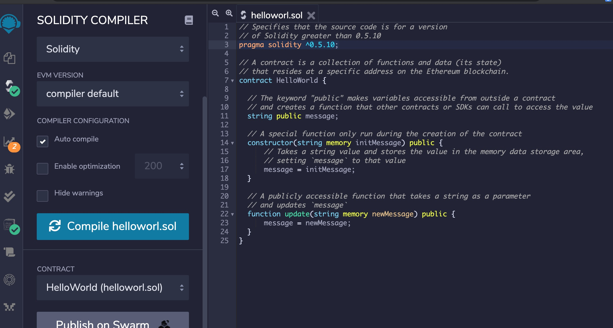
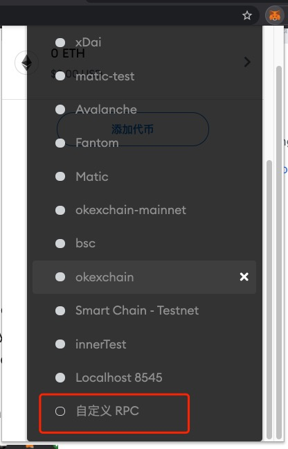
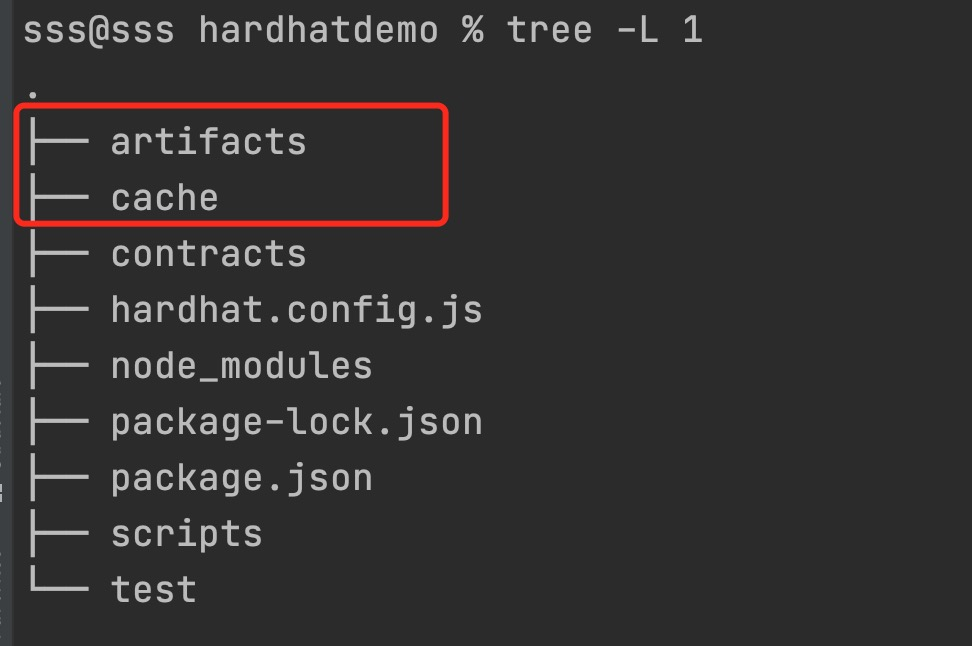

# 在ontology链上开发EVM合约

## ontology支持EVM的介绍

ontology链已经完全支持EVM合约，并且支持ethereum相关的合约调用工具如web3js等。

## Developer Quick Start

如果你已经是一名ethereum开发者那么你同时也是一名ontology开发者。

## 部署EVM合约到ontology链

  ethereum合约可以用solidity语言开发，[solidity教程](https://docs.soliditylang.org/en/v0.8.6/)

- 使用Remix工具
  这是一个hello world 合约样例，这个合约可以用于存一段字符串，并且查询。
    - RemixIDE的使用
      [Remix IDE](https://remix.ethereum.org/#optimize=false&runs=200&evmVersion=null&version=soljson-v0.8.1+commit.df193b15.js)是一个在线的ethereum合约开发工具。
    - 新建`helloworld.sol`合约
      
      ```
      // Specifies that the source code is for a version
      // of Solidity greater than 0.5.10
      pragma solidity ^0.5.10;
      
      // A contract is a collection of functions and data (its state)
      // that resides at a specific address on the Ethereum blockchain.
      contract HelloWorld {
      
          // The keyword "public" makes variables accessible from outside a contract
          // and creates a function that other contracts or SDKs can call to access the value
          string public message;
      
          // A special function only run during the creation of the contract
          constructor(string memory initMessage) public {
              // Takes a string value and stores the value in the memory data storage area,
              // setting `message` to that value
              message = initMessage;
          }
      
          // A publicly accessible function that takes a string as a parameter
          // and updates `message`
          function update(string memory newMessage) public {
              message = newMessage;
          }
      }
      ```
    - 编译合约
      
      点击下图中的`Compile helloworld.sol`按钮编译合约。
      
      
    - 部署合约
      现在需要把我们编译好的合约部署到ontology链上，为了能链上ontology节点，
      我们可以用Metamask这样的wallet来完成。
      打开Metamask,设置网络，如下图所示
      
      - 输入网络名 - "ontology testnet"
      - 输入节点url - "http://localhost:20339"
      - 输入Chain ID:12345
      - 输入区块链浏览器url - "https://explorer.ont.io/"
    - 调用合约

- 使用Truffle
    - 安装truffle
    - 配置truffle-config
    - 部署合约到ontology链


- 使用Hardhat
    - 搭建Hardhat开发环境
    - 配置hardhat-config
    - 部署合约到ontology链

## 网络详情

- 节点网络

  主网信息

  |name|value| 
    |:---|:---|
  |NetworkName|Ontology Network| 
  |ParentChain|Ethereum Mainnet| 
  |chainId|5851| 
  |Gas Token|ONG Token| 
  |RPC|http://localhost:20339|
  |Websocket|http://localhost:20339| 
  |Block Explorer|https://explorer.ont.io/|

测试网信息

|name|value| 
|:---|:---|
|NetworkName|Ontology Network| 
|ParentChain|Ethereum Mainnet| 
|chainId|5851| 
|Gas Token|ONG Token| 
|RPC|http://localhost:20339|
|Websocket|http://localhost:20339| 
|Block Explorer|https://explorer.ont.io/|

- ontology链上EVM资产列表

  |tokenName|tokenAddress|
    |:---|:---|
  |ONG|0x00000000000000000000000000000000000000001|

- oep4资产列表


- 手续费ONG
    - 如何获得ONG 主网上的和测试网上的

## Wallets

- Getting Started

- MetaMask
    1. Set up web3
    ```
    npm install --save web3
    ```
    2. Set up account
    3. Instamtiate your account
    4. Call functions

According to [Metamask’s API documentation](https://docs.metamask.io/guide/ethereum-provider.html#upcoming-provider-changes)

## ethereum链上的资产跨到ontology链上

[PolyBridge](https://bridge.poly.network/)

## ontology链上 NEOVM资产和EVM资产交换

- 可以通过bridge合约进行转换

## 在ontology链上开发一个新的EVM合约
这部分我们会使用`hardhat`工具开发部署和测试EVM合约，并且会在本地起一个ontology节点用于测试合约。

### 环境准备
- nodejs

[nodejs 安装文档](https://nodejs.org/en/) 如果您的电脑已经安装请忽略。
  
- hardhat 

[hardhat安装教程](https://hardhat.org/getting-started/)。
  
- ontology节点

1. 下载[ontology源码](https://github.com/ontio/ontology)
执行如下的命令编译得到可执行文件
```
git clone https://github.com/ontio/ontology.git
$ cd ontology
$ make all
```
2. 启动[本地测试节点](https://github.com/ontio/ontology#local-privatenet)


### 红包合约设计
1. 合约Demo逻辑
我们会开发一本发红包的合约例子，主要提供以下功能
   - 发红包
   - 领红包
每次发红包要指定该红包的大小和该红包的数量，例如，一个红包的大小是100个token，红包的数量是10，
也就是每个地址可以领10个token， 总共可以有10个不同的地址领取该红包。为了简单起见，每个红包的大小设置为一样。
以上的逻辑我们可以设置如下的存储结构
```
EIP20Interface public token; // support token address
uint public nextPacketId; // the next redpacket ID

// packetId -> Packet, store all the redpacket
mapping(uint => Packet) public packets;

//packetId -> address -> bool,  store receive redpacket record
mapping(uint => mapping(address => bool)) public receiveRecords;

struct Packet {
    uint[] assetAmounts;// Number of tokens per copy
    uint receivedIndex; // Number of red packets received
}
```
2. 定义合约事件

在合约执行的过程中，我们可以通过添加事件，来追溯合约执行流程。在该合约例子中，我们会设计两个事件，
一个是发红包时，合约会生成红包的ID,该ID要通过事件推送给调用者；另外一个事件是领取红包时，需要推送一个事件用来记录用去领取的红包ID和token数量。
```
event SendRedPacket(uint packetId, uint amount);
event ReceiveRedPacket(uint packetId, uint amount);
```

3. 定义函数
   
- `sendRedPacket`

发红包，任何人都可以调用该接口，将一定量的token打给该合约地址，从而其他的地址可以从该合约地址领取红包。有一点需要注意的是，在调用该方法之前，
需要先授权该合约地址能够从用户的地址把token转移走，所以需要先调用该token的 `approve`方法。
```
function sendRedPacket(uint amount, uint packetNum) public payable returns (uint) {
    require(amount >= packetNum, "amount >= packetNum");
    require(packetNum > 0 && packetNum < 100, "packetNum>0 && packetNum < 100");
    uint before = token.universalBalanceOf(address(this));
    token.universalTransferFrom(address(msg.sender), address(this), amount);
    uint afterValue = token.universalBalanceOf(address(this));
    uint delta = afterValue - before;
    uint id = nextPacketId;
    uint[] memory assetAmounts = new uint[](packetNum);
    for (uint i = 0; i < packetNum; i++) {
        assetAmounts[i] = delta / packetNum;
    }
    packets[id] = Packet({assetAmounts : assetAmounts, receivedIndex : 0});
    nextPacketId = id + 1;
    emit SendRedPacket(id, amount);
    return id;
}
```

- `receivePacket`

领取红包，任何地址都可以通过调用该接口领取红包，调用该接口的时候需要指定红包的ID，也就是指定要领取哪个红包。

```
function receivePacket(uint packetId) public payable returns (bool) {
    require(packetId < nextPacketId, "not the redpacket");
    Packet memory p = packets[packetId];
    if (p.assetAmounts.length < 1) {
        return false;
    }
    require(p.receivedIndex < p.assetAmounts.length - 1, "It's over");
    require(receiveRecords[packetId][address(msg.sender)] == false, "has received");
    p.receivedIndex = p.receivedIndex + 1;
    bool res = token.universalTransfer(msg.sender, p.assetAmounts[p.receivedIndex]);
    require(res, "token transfer failed");
    packets[packetId] = p;
    receiveRecords[packetId][address(msg.sender)] == true;
    emit ReceiveRedPacket(packetId, p.assetAmounts[p.receivedIndex]);
    return true;
}
```
[合约完整的代码](https://github.com/lucas7788/hardhatdemo/blob/master/contracts/Redpacket.sol)

### 使用hardhat编译和测试合约

1. 使用如下命令创建一个hardhat项目
```
mkdir hardhatdemo
cd hardhatdemo
npm init
npm install --save-dev hardhat
```

2. 启动本地`ontology`节点
```
./ontology --testmode
```

3. 修改`hardhat.config.js` 文件，添加本地节点配置信息
```
module.exports = {
    defaultNetwork: "ontology_testnet",
    networks: {
        hardhat: {},
        ontology_testnet: {
            url: "http://127.0.0.1:20339",
            chainId: 12345,
            gasPrice:500,
            gas:2000000,
            timeout:10000000,
            accounts: ["59c6995e998f97a5a0044966f0945389dc9e86dae88c7a8412f4603b6b78690d",
            "0x6b98389b8bb98ccaa68876efdcbacc4ae923600023be6b4091e69daa59ba9a9d"]
        }
    },
    solidity: {
        version: "0.8.0",
        settings: {
            optimizer: {
                enabled: true,
                runs: 200
            }
        }
    },
};
```

accounts字段指定的私钥数组，对应的地址需要有本地测试节点的ONG,用于付交易的手续费。
首先可以通过Metamask钱包插件根据私钥导出对应的地址(hex格式)，然后通过[该方法](https://github.com/ontio/ontology/blob/master/common/address.go#L82)生成对应的ontology base58编码的地址。
为了方便开发者操作，这两个私钥对应的base58编码的地址分别是 `AS3FBa1i2EiySRVEhzg5LRCGuBCG1qVfsL` 和 `ATu1iXMk2DcwiG5LVvoouc82NNNtJ5Hv6G`。向这两个地址转ONG[请参考](https://github.com/ontio/ontology#ont-transfer-sample)


4. 把之前的红包合约代码文件放到 `contracts`文件夹下，为了支持ERC20的转账，我们还需要
`EIP20Interface.sol`, `UniversalERC20.sol`, 和 `TokenDemo.sol`文件，可以从[此处](https://github.com/lucas7788/hardhatdemo/tree/master/contracts)下载相关文件

5. 在`test`文件夹下添加测试代码
```
describe("RedPacket", function () {
    let tokenDemo, redPacket, owner, acct1, assetAmount, packetAmount;
    beforeEach(async function () {
        const TokenDemo = await ethers.getContractFactory("TokenDemo");
        tokenDemo = await TokenDemo.deploy(10000000, "L Token", 18, "LT");
        await tokenDemo.deployed();
        const RedPacket = await ethers.getContractFactory("RedPacket");
        redPacket = await RedPacket.deploy(tokenDemo.address);
        await redPacket.deployed();
        [owner, acct1] = await ethers.getSigners();
        assetAmount = 1000;
        packetAmount = 10;
    });
    it("token", async function () {
        expect(await redPacket.token()).to.equal(tokenDemo.address);
    });
    it("sendRedPacket", async function () {
        const approveTx = await tokenDemo.approve(redPacket.address, assetAmount);
        await approveTx.wait();

        const sendRedPacketTx = await redPacket.sendRedPacket(assetAmount, packetAmount);
        await sendRedPacketTx.wait();
        let balance = await tokenDemo.balanceOf(redPacket.address);
        expect(balance.toString()).to.equal(assetAmount.toString());

        res = await redPacket.nextPacketId();
        expect(res.toString()).to.equal("1");

        await redPacket.connect(acct1).receivePacket(0);
        balance = await tokenDemo.balanceOf(acct1.address);
        expect(balance.toString()).to.equal((assetAmount / packetAmount).toString());
    });
});
```

6. 编译合约

在项目根目录执行如下的命令编译合约，
```
$ npx hardhat compile
Compiling 5 files with 0.8.0
Compilation finished successfully
```
该命令执行完成后会生成如下的文件夹


7. 测试合约
```
npx hardhat test
```
